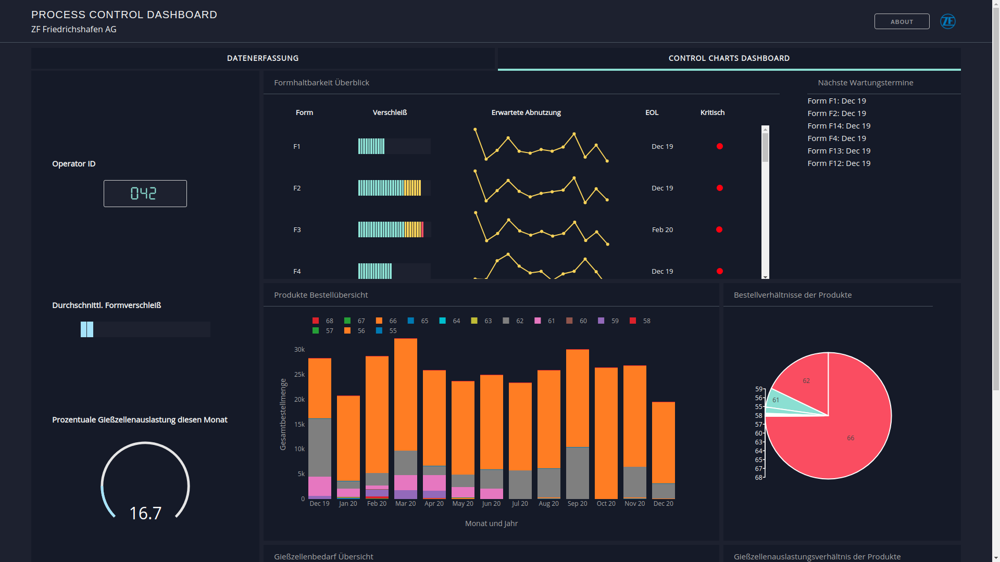

# ZF Werkzeugprozesskontrolle

Entwickelt von Wilhelm Kirchgässner für IT-Talents und ZF Friedrichshafen.

## Einleitung
Dies ist eine Demo für die [IT-Talents competition mit ZF](https://www.it-talents.de/foerderung/code-competition/zf-code-competition-11-2019/).
Dieses Dashboard-Konzept hilft den Operatoren den Überblick über den
Werkzeugbestand zu behalten als auch der Logistik neue Bestellungen zu erfassen.

## Screenshots



## Built With
* [Dash](https://dash.plot.ly/) - Main server and interactive components 
* [Plotly Python](https://plot.ly/python/) - Used to create the interactive plots
* [Dash DAQ](https://dash.plot.ly/dash-daq) - Styled technical components for industrial applications

## Requirements
Wie bei allen Python-Projekten wird auch hier eine separate virtuelle
 Umgebung empfohlen z.B. mit [Conda](https://anaconda.org/anaconda/conda ) 
 oder [virtualenv](https://virtualenv.pypa.io/en/latest/).
 
Unabhängig davon muss folgendes ausgeführt werden:
 Im Terminal/Command Prompt:
 ```
git clone https://github.com/wkirgsn/zf-tool-lifetime.git
pip install -r requirements.txt
```
Die erste Zeile lädt das Repository runter, während die zweite Zeile alle 
benötigten Python-packages installiert.

## Getting Started
Die App kann lokal ausgeführt werden mit
```
python app.py
```
Wenn jetzt http://0.0.0.0:8050/ im Browser geöffnet wird, so ist das 
live-Dashboard zu sehen.

## Was ist zu sehen
###Datenerfassung

Füge dem Datenbestand entweder neue Einzelbestellungen, Batch-Bestellungen 
oder einen völlig neuen weiteren Datensatz hinzu.
Der aktuelle Datensatz wird automatisch gefiltert und zeigt alle Bestellungen 
der momentan ausgewählten Abrufzeiten, Kunden und Produkte.
Mit Klick auf den "Update"-Knopf werden die erfassten neuen Bestellungen dem 
aktuellen Datensatz hinzugefügt. Dabei sind Stornierungen ebenso möglich, 
indem man eine negative Zahl als Abrufmenge definiert.

Über das Drag-n-Drop Feld lässt sich eine CSV- oder XLS/X-Datei hochladen, 
welche in den aktuellen Datensatz eingebettet wird (bitte Format beachten).

Wichtig: Neue Kunden, Gußformen oder Produkte können hier nicht aufgenommen 
werden. Wenden Sie sich dafür bitte an den Systemadministratoren.

### Control Charts Dashboard
Das Dashboard ist in zwei grobe Bereiche aufgeteilt: Quick Stats (links bzw. 
oben bei mobiler Ansicht) mit kurzen übersichtlichen Statistiken, sowie 
detailliertere Visualisierungen auf der anderen Seite.

Der Formhaltbarkeit-Überblick zeigt wie weit der Verschleiß für jede Form 
vorangeschritten ist. Die gelbe Sparkline zeigt den zu erwartenden Verschleiß 
für die nächsten 12 Monate an. EOL (End-of-life) informiert über den Monat der 
Wartung/Austausch der Form. Ist dieser in den nächsten drei Monaten, so ist 
dies als kritisch zu bewerten (roter Indikator).

Die Produkt-Bestellübersicht, sowie die Gießzellenbedarf-Übersicht zeigen auf
einen Blick wie viel von jedem Produkt bisher bestellt wurde und welchen 
Gießzellenbedarf sie verursachen, über die nächsten 12 Monate erstreckt.
Die Kuchendiagramme daneben geben einen Überblick in welchen 
Mengenverhältnissen die verschiedenen Produkte dabei stehen.

## Todo-Liste
Vieles kann noch besser gemacht werden durch:
* Interaktive Datenerfassung von völlig neuen Kunden, Produkten und Formen,
* Zeitfilterung beim Control Chart Dashboard,
* Umfassende ML-Prognosen auf Basis vorhandener Daten zur zukünftigen
 Formverschleiß- sowie Bestell-Entwicklung
